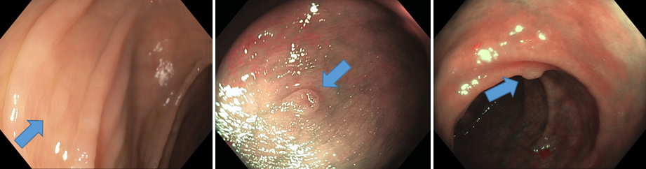
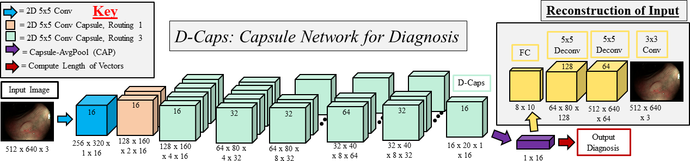
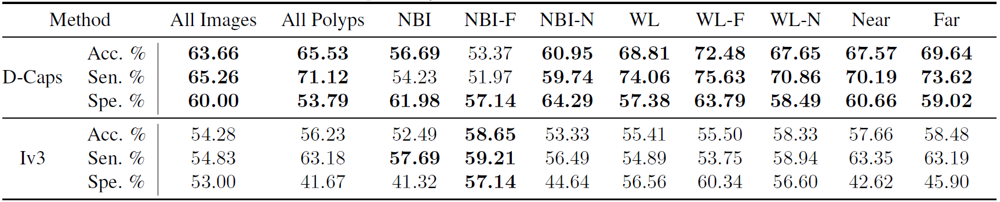
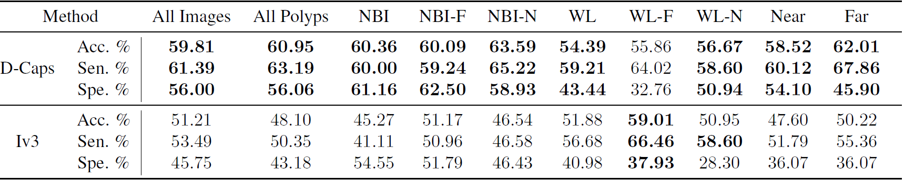
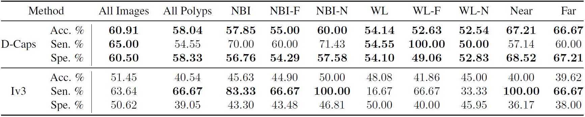

# D-Caps: Diagnosis Capsules

### by [Rodney LaLonde](https://rodneylalonde.wixsite.com/personal), [Pujan Kandel](https://scholar.google.com/citations?user=SRFTA9gAAAAJ&hl=en), [Concetto Spampinato](https://scholar.google.com/citations?user=Xc2rx8j4O7UC&hl=en), [Michael B. Wallace](https://www.mayo.edu/research/faculty/wallace-michael-b-m-d/bio-00092410), and [Ulas Bagci](http://www.cs.ucf.edu/~bagci/)

### The official code for the ISBI 2020 paper "Diagnosing Colorectal Polyps in the Wild with Capsule Networks" will be uploaded to this repository shortly. Watch/Star this repo to be updated on when the code is uploaded.

The original paper can be found at ISBI 2020 or [arXiv](https://arxiv.org/abs/2001.03305).

A project page for this work can be found at [my research blog](https://rodneylalonde.wixsite.com/personal/post/d-caps-diagnosis-capsules).

## Summary
Colorectal cancer, largely arising from precursor lesions called polyps, remains one of the leading causes of cancer-related death worldwide. Current clinical standards require the resection and histopathological analysis of polyps due to test accuracy and sensitivity of optical biopsy methods falling substantially below recommended levels. In this study, we design a novel capsule network architecture (D-Caps) to improve the viability of optical biopsy of colorectal polyps. Our proposed method introduces several technical novelties including a novel capsule architecture with a capsule-average pooling (CAP) method to improve efficiency in large-scale image classification. We demonstrate improved results over the previous state-of-the-art convolutional neural network (CNN) approach by as much as 43%. This work provides an important benchmark on the new Mayo Polyp dataset, a significantly more challenging and larger dataset than previous polyp studies, with results stratified across all available categories, imaging devices and modalities, and focus modes to promote future direction into AI-driven colorectal cancer screening systems. 

## Colorectal Polyp Images Obtained From Colonoscopy Screenings



*Typical cases on real-world ('in-the-wild') polyp diagnosis cases from the Mayo Polyp dataset. Left to right: hyperplastic, serrated, and adenoma, marked by blue arrows.*


**Research Gap:** Previous academic works have achieved remarkable success in this difficult task, with accuracy scores just exceeding 90%. **However, these methods have been applied to academic datasets which are highly unrealistic compared to a 'real-world' clinical setting.** For example, the most popular dataset in the literature is the ISIT-UMR Multimodal classification dataset, containing only 76 polyps. Each polyp is recorded up-close for approximately 30 seconds (nearly 800 videos frames) from multiple angles, modalities, and focus modes. Such time-consuming and ideal videos cannot be expected in more realistic 'in the wild' (i.e., real-world) clinical settings. To address this discrepancy between ideal academic datasets and real-world examples, we performed experiments on the significantly more challenging Mayo Polyp classification dataset, collected at the Mayo Clinic, Jacksonville by Wallace et al. with institutional review board approval. A total of 963 polyps from 552 patients were collected, where one image per imaging type of each polyp are chosen by expert interpreters. This dataset is extremely challenging, having only **single images per imaging mode per polyp**, large inter-polyp variation (e.g., scale, skew, illumination), and often only a single imaging mode provided, while also containing far more polyps collected from more patients than all previous AI-driven diagnosis studies in this area.


## D-Caps Framework Overview



*D-Caps: Diagnosis capsule network architecture. Routing 1 or 3 refers to the number of routing iterations performed.*


To accomplish our task and improve the viability of optical biopsy of colorectal polyps, we design a novel capsule network (D-Caps). Capsule networks provide equivariance to affine transformations on the input through encoding orientation information in vectorized feature representations, and we hypothesize that a capsule network can better model the high intra-class variation present in the Mayo Polyp dataset and provide superior results to a deep CNN. Our method introduces several technical novelties including (i) a novel deep capsule network architecture based on the locally-constrained routing introduced in (LaLonde and Bagci 2018), (ii) a capsule-average pooling (CAP) technique which allows us to perform classification on large image sizes, where the original fully-connected capsules of Sabour et al. are far too computationally expensive to fit in GPU memory, and (iii) improves the results over CNNs such as Inceptionv3 (Iv3) employed the previous state-of-the-art (Chen et al. 2018) by a significant margin, while also reducing the amount of parameters used by as much as 95%. We provide extensive analysis of results stratified across polyp categories, scanner types, imaging modalities, and focus modes to establish a new benchmark on this challenging, unexplored, large-scale dataset and promote future direction into the use of AI-driven colorectal cancer screening systems.

## Quantitative Results on Mayo Polyp Dataset

*Classifying Hyperplastic vs Adenoma polyps with D-Caps and Inceptionv3 measured by accuracy (acc), sensitivity (sen), and specificity (spe), where -F and -N denote far and near focus, respectively.*




*Classifying Hyperplastic vs Adenoma and Serrated polyps with D-Caps and Inceptionv3 measured by accuracy (acc), sensitivity (sen), and specificity (spe), where -F and -N denote far and near focus, respectively.*




*Classifying Hyperplastic vs Serrated polyps with D-Caps and Inceptionv3 measured by accuracy (acc), sensitivity (sen), and specificity (spe), where -F and -N denote far and near focus, respectively.*




## Results and Discussion
The results of the three sets of experiments in presented in Tables 1-3. For all experiments, we present results at several levels of analysis: All Images presents results for every image present in the dataset, while all other results are a weighted average taken across all votes for a given polyp (and imaging modality) to give a final diagnosis score. Looking at the All Polyps columns, we can see D-Caps outperforms Inceptionv3 in terms of relative accuracy increases of 17%, 27%, and 43% for experiments 1-3 (of increasing difficulty) respectively. 
In our routing iteration ablation experiment, we obtained  50.61%, 65.53%, 45.97%, and 50.86% accuracy at the polyp level for 2, 3, 4, and 5 routing iterations respectively. Removing the reconstruction sub-network obtained 56%, 50%, and 55% accuracy at the for experiments 1-3 respectively, an average 8% decrease. Lastly on the ideal subset of physician chosen images, we obtained an accuracy of 82% for hyperplastic vs adenoma. These experiments show the dynamic routing and reconstruction both contribute to the overall performance of our model, while the latter experiment provides strong evidence that with further improvements in both capsule network algorithms and screening technology, AI-driven approaches can prove viable for raising optical biopsy techniques to clinical practice standards. Our work provides an important baseline for future studies on the extremely challenging Mayo Polyp dataset, and contributes further evidence that given limited data with high intra-class variation, capsule networks can significantly outperform deep CNNs.


## Running the code
1. [Optional] Create a virtual environment with anaconda and python 3.6 
    ```bash
    conda create -n your_env_name python=3.6
    conda activate your_env_name
    ```
2. Clone this repository to whatever working directory you would like
    ```bash
    git clone https://github.com/lalonderodney/D-Caps.git
    ```
3. Change directories into the D-Caps directory
    ```bash
    cd D-Caps
    ```
4. Install the required packages (preferably in a virtual environment.)
    ```bash
    pip install -r requirements.txt
    ```
5. Ensure you have the Mayo dataset downloaded somewhere. If you wish to use another dataset, adjust the naming inside load_polyp_data.py

6. Set the path to the Mayo Polyp dataset and run the code
    ```bash
    python main.py --data_root_dir /path/to/parent_dir/of/datasets --dataset "Mayo"
    ```
 7. There are many more optional arguments within main.py. Give them a look, each one has a help string to explain what it is.


### Questions or Comments

Please direct any questions or comments to me; I am happy to help in any way I can. You can either comment on the [project page](https://rodneylalonde.wixsite.com/personal/post/d-caps-diagnosis-capsules), or email me directly at lalonde@knights.ucf.edu.

